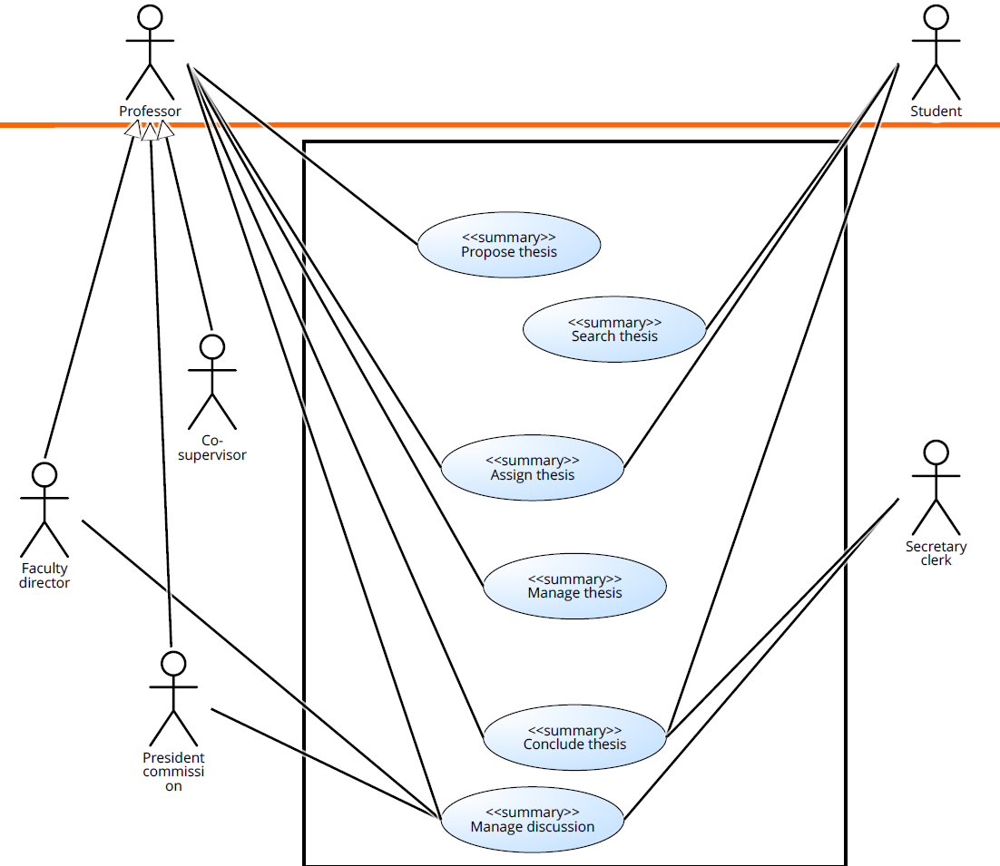

# thesis-management-team17
Software Engineering II Project 2023-2024

# Thesis Management: requirements description

Date: 14/12/2023

Version for Demo 3

| Demo Version | Changes                                                                                                                                                                              |
| ------------ | :----------------------------------------------------------------------------------------------------------------------------------------------------------------------------------- |
| Demo 1       | Implemented Search Proposals and SAML 2.0 authentication                                                                                                                             |
| Demo 2       | Implemented Insert Proposal, Apply for Proposal, Browse Applications, Accept Application, Browse Applications Decisions, Browse, Update, Delete, Archive Proposal and Search Archive |
| Demo 3       | Implemented Notify Application and Application Decision, Copy Proposal, Access Applicant CV, Insert Student Request |

## Contents

- [thesis-management-team17](#thesis-management-team17)
- [Thesis Management: requirements description](#thesis-management-requirements-description)
  - [Contents](#contents)
  - [Informal description](#informal-description)
  - [Stories](#stories)
  - [Use case diagram](#use-case-diagram)
  - [Users](#users)
    - [User Privileges](#user-privileges)
    - [Users Credentials](#users-credentials)
  - [General Information about the Project Management](#general-information-about-the-project-management)
    - [Authentication with SAML2.0](#authentication-with-saml20)
    - [Docker Implementation](#docker-implementation)
      - [Docker Pull and Run commands](#docker-pull-and-run-commands)
      - [Docker Ports](#docker-ports)
    - [SonarCloud and Technical Debts](#sonarcloud-and-technical-debts)
  - [API Specifications](#api-specifications)
    - [API List](#api-list)
      - [AuthenticationAPI.js](#authenticationapijs)
        - [`getSessionAPI`](#getsessionapi)
      - [FetchAPIs.js](#fetchapisjs)
        - [`get`](#get)
        - [`delete`](#delete)
        - [`post`](#post)
      - [ApplicationsAPI.js](#applicationsapijs)
        - [`getAllApplications`](#getallapplications)
        - [`acceptApplication`](#acceptapplication)
        - [`rejectApplication`](#rejectapplication)
        - [`getMyApplications`](#getmyapplications)
        - [`getApplicationsByTeacherProposals`](#getapplicationsbyteacherproposals)
        - [`applyToProposal`](#applytoproposal)
      - [UtilitiesAPI.js](#utilitiesapijs)
        - [`getListCds`](#getlistcds)
        - [`getExternalCosupervisorList`](#getexternalcosupervisorlist)
        - [`addExternal`](#addexternal)
        - [`getKeywordsList`](#getkeywordslist)
        - [`getAllGroups`](#getallgroups)
        - [`getListTeacher`](#getlistteacher)
      - [ProposalsAPI.js](#proposalsapijs)
        - [`addOrUpdateProposal`](#addorupdateproposal)
        - [`deleteProposal`](#deleteproposal)
        - [`archiveProposal`](#archiveproposal)
        - [`getAllProposals`](#getallproposals)
        - [`getStudentApplicationsProposals`](#getstudentapplicationsproposals)
        - [`getAvailableProposalsForStudent`](#getavailableproposalsforstudent)
        - [`getActiveProposals`](#getactiveproposals)
        - [`getArchivedProposals`](#getarchivedproposals)
        - [`searchProposals`](#searchproposals)
      - [DateAPI.js](#dateapijs)
        - [`getDate`](#getdate)
        - [`setDate`](#setdate)
        - [`resetDate`](#resetdate)

## Informal description

The Thesis Management is a web application designed for the proper management of theses at PoliTo, providing the ability to propose and/or search for available thesis work, assign and organize theses, facilitate discussions about theses, and view details about the work. There are six user roles in the system: professor, student, co-supervisor, faculty director, president of the commission, and secretary clerk. After logging in, each user can perform several actions.

## Stories

| Issue-id |             Story             |                                                                                                                  Description |
| -------- | :---------------------------: | ---------------------------------------------------------------------------------------------------------------------------: |
| TM-1     |        Insert Proposal        |                                       As a **Professor** I wanto to insert a thesis proposal so that student can apply to it |
| TM-2     |       Search Proposals        |                        As a **Student** I want to search for thesis proposal so that i can find one that matches my interest |
| TM-3     |      Apply for Proposal       | As a **Student** I want to apply fot an existing thesis proposal so that the proposing professor can evaluate my application |
| TM-4     |      Browse Applications      |                            As a **Professor** I want to see the list of all applications so that I can accept or reject them |
| TM-5     |      Accept Application       |                                   As a **Professor** I want to accept or reject an application for existing thesis proposals |
| TM-6     | Browse Applications Decisions |                                                       As a **Student** I want to see the list of decisions on my application |
| TM-7     |       Browse Proposals        |                          As a **Professor** I want to view the list of active thesis proposals so that I can operate on them |
| TM-8     |        Update Proposal        |                                                                          As a **Professor** I  want to update a thesis proposal |
| TM-9     |  Notify Application Decision  |                                                                          As a **Student** I want to be notified when a decision on my application on a thesis proposal is taken |
| TM-10    |        Delete Proposal        |                                                                        As a **Professor** I want to delete a thesis proposal |
| TM-11    |        Copy Proposal        |                                                                        As a **Professor** I want to insert a thesis proposal starting from an existing one so that student can apply to it |
| TM-12    |       Archive Proposal        |                                      As a **Professor** I want to archive a thesis proposals. So that I can later consult it |
| TM-13    |        Access Applicant CV        |                                                                        As a **Professor** I want to see the applicant student CV so that I can assess the suitability for the thesis |
| TM-14    |        Notify Application        |                                                                        As a **Professor** I want to be notified when a new applicant is sent so that I can evaluate it |
| TM-16    |        Search Archive         |                                      As a **Professor** I want to archive a thesis proposals. So that I can later consult it |
| TM-26    |    Insert Student Request     |                                      As a **Student** I want to make a new thesis start request so that it can be approved |

## Use case diagram

## Users 

| Role          | Actions                                                                                                                                                                                                                                                    |
| ------------- | :--------------------------------------------------------------------------------------------------------------------------------------------------------------------------------------------------------------------------------------------------------- |
| **Student**   | A generic Student can search for an existing thesis proposal, submit an application and view the decision made by a professor regarding their application and consequently make a request (to be approved by the professor) to start working on a thesis proposal. When a teacher take a decision on one of the student applications, the student is notified. |
| **Professor** | The primary actions a teacher can perform include inserting new thesis proposals and reviewing all active ones. Additionally, after beeing notified, they can access a list of applications for existing thesis proposals (made by a student) and make decisions on whether to accept or reject them. Moreover a professor can update, delete or archive a thesis proposal or copy a new one starting from another already existing. A teacher can also see a student's CV when evaluating an application for a thesis proposal to assess its suitability. |

### User Privileges
|    Story    | Student | Professor |
| :---------: | :-----: | :-------: |
| TM story 1  |         |     X     |
| TM story 2  |    X    |           |
| TM story 3  |    X    |           |
| TM story 4  |         |     X     |
| TM story 5  |         |     X     |
| TM story 6  |    X    |           |
| TM story 7  |         |     X     |
| TM story 8  |         |     X     |
| TM story 9  |    X    |           |
| TM story 10 |         |     X     |
| TM story 11 |         |     X     |
| TM story 12 |         |     X     |
| TM story 13 |         |     X     |
| TM story 14 |         |     X     |
| TM story 16 |         |     X     |
| TM story 26 |    X    |           |

### Users Credentials

|           Email            | Password | Role          |
| :------------------------: | -------: | ------------- |
| s301316@studenti.polito.it |  s301316 | **Student**   |
| s308344@studenti.polito.it |  s308344 | **Student**   |
| s314140@studenti.polito.it |  s314140 | **Student**   |
| s317989@studenti.polito.it |  s317989 | **Student**   |
| s319572@studenti.polito.it |  s319572 | **Student**   |
| s319976@studenti.polito.it |  s319976 | **Student**   |
|      d12571@polito.it      |   d12571 | **Professor** |
|      d23817@polito.it      |   d23817 | **Professor** |
|      d54723@polito.it      |   d54723 | **Professor** |
|      d78912@polito.it      |   d78912 | **Professor** |
|      d96970@polito.it      |   d96970 | **Professor** |

## General Information about the Project Management 

### Authentication with SAML2.0

For the authentication we initially implemented **passport-auth0**, but encountered limitations as it only supports AUTH0 as an Identity Provider (IDP). 

To overcome this restriction and enhance compatibility with different IDPs available on the web, we decided to transition to **passport-saml**. This alternative solution enables us to configure and integrate with a broader range of web-based identity providers.

### Docker Implementation

Regarding Docker, you can download both the client and server images at: 

https://hub.docker.com/repository/docker/s317989/thesis-management-team17

#### Docker Pull and Run commands

**Method 1**

To download the images and successfully run the project, please follow these steps:

- docker run -p 5173:5173 -d s317989/thesis-management-team17:client-tag
- docker run -p 3000:3000 -d s317989/thesis-management-team17:server-tag
  
After completing the above steps, docker will pull automatically the images and will create a single container with the two images running, so it allows you to open the client via localhost:5173.

**Method 2**

To download the images and successfully run the project, please follow these steps:

- Create a directory and name it as desired --> ThesisManagementTeam17
- Copy the docker-compose.yml file and paste it into the newly created directory
- Run docker-compose up

After completing the above steps, wait a few seconds for everything to be executed successfully, and then you can open the client via localhost:5173.

#### Docker Ports
The **client** will be accessible on the following ports:
- Local: http://localhost:5173/
- Network: http://192.168.68.114:5173/

The **server** will be accessible on the port:
- Local: http://localhost:3000/ 

### SonarCloud and Technical Debts

It has been noted that, among the various aspects that can be sources of **Technical Debt (TD)**, those most influential on code quality and correctness are related to minor defects in code writing (Defect Debt). Therefore, the focus has not been on TD related to: documentation (Documentation Debt), regularly updated; testing phase (Testing Debt), conducted very frequently; organization of files and classes (Design/Architecture Debt), as the entire project structure has been reviewed to make it more organized and understandable. 

For the practical management of TD in the context of code writing, the tool **SonarCloud** has been used. Through the Automatic Analysis Tool (ASA), it has highlighted and drawn attention to the most evident issues, namely those related to 'Security Review' ('Security Hotspot') and various minor bugs.

## API Specifications

This part of the document lists all the expected behaviors for the APIs that compose the Thesis Management application.

### API List

#### AuthenticationAPI.js

##### `getSessionAPI`

- Request Parameters: None
- URL: http://localhost:3000/api/auth/session
- Method: GET
- Body content: None
- Returns a 401 error with an error message "Unauthorized" if the user role is not a **student** or a **professor**

#### FetchApis.js

##### `get`

- Request Parameters: `url`
- URL: http://localhost:3000/api/`url`
- Method: GET
- Body content: None
- Returns an error message status if not performed correctly

##### `delete`

- Request Parameters: `url`, `body`
- URL: http://localhost:3000/api/`url`
- Method: DELETE
- Body content: content of the `body` parameter
- Returns an error message status if not performed correctly

##### `post`

- Request Parameters: `url`, `body`
- URL: http://localhost:3000/api/`url`
- Method: POST
- Body content: content of the `body` parameter
- Returns an error message status if not performed correctly

#### ApplicationsAPI.js

##### `getAllApplications`

- Request Parameters: None
- URL: http://localhost:3000/api/applications/all
- Method: GET
- Body content: None
- Returns an error message status if not performed correctly

##### `acceptApplication`

- Request Parameters: `applicationId`
- URL: http://localhost:3000/api/applications/accept
- Method: POST
- Body content: content of the `applicationId` parameter
- Returns an error message status if not performed correctly

##### `rejectApplication`

- Request Parameters: `applicationId`
- URL: http://localhost:3000/api/applications/reject
- Method: POST
- Body content: content of the `applicationId` parameter
- Returns an error message status if not performed correctly

##### `getMyApplications`

- Request Parameters: None
- URL: http://localhost:3000/api/applications/mine
- Method: GET
- Body content: None
- Returns an error message status if not performed correctly

##### `getApplicationsByTeacherProposals`

- Request Parameters: None
- URL: http://localhost:3000/api/applications/for-my-proposals
- Method: GET
- Body content: None
- Returns an error message status if not performed correctly

##### `applyToProposal`

- Request Parameters: `proposalId`
- URL: http://localhost:3000/api/applications/apply
- Method: POST
- Body content: content of the `proposalId` parameter
- Returns an error message status if not performed correctly

#### UtilitiesAPI.js

##### `getListCds`

- Request Parameters: None
- URL: http://localhost:3000/api/utilities/degrees
- Method: GET
- Body content: None
- Returns an error message status if not performed correctly

##### `getExternalCosupervisorList`

- Request Parameters: None
- URL: http://localhost:3000/api/utilities/external-cosupervisors
- Method: GET
- Body content: None
- Returns an error message status if not performed correctly

##### `addExternal`

- Request Parameters: `surname`, `name`, `email`
- URL: http://localhost:3000/api/utilities/archive
- Method: POST
- Body content: content of the parameters: `surname`, `name`, `email`
- Returns an error message status if not performed correctly

##### `getKeywordsList`

- Request Parameters: None
- URL: http://localhost:3000/api/utilities/keywords
- Method: GET
- Body content: None
- Returns an error message status if not performed correctly

##### `getAllGroups`

- Request Parameters: None
- URL: http://localhost:3000/api/utilities/groups
- Method: GET
- Body content: None
- Returns an error message status if not performed correctly

##### `getListTeacher`

- Request Parameters: None
- URL: http://localhost:3000/api/utilities/teachers
- Method: GET
- Body content: None
- Returns an error message status if not performed correctly

#### ProposalsAPI.js

##### `addOrUpdateProposal`

- Request Parameters: `proposal`
- URL: http://localhost:3000/api/proposals/edit
- Method: POST
- Body content: content of the `proposal` parameter
- Returns an error message status if not performed correctly

##### `deleteProposal`

- Request Parameters: `proposalId`
- URL: http://localhost:3000/api/proposals/delete
- Method: DELETE
- Body content: content of the `proposalId` parameter
- Returns an error message status if not performed correctly

##### `archiveProposal`

- Request Parameters: `proposalId`
- URL: http://localhost:3000/api/proposals/archive
- Method: POST
- Body content: content of the `proposalId` parameter
- Returns an error message status if not performed correctly

##### `getAllProposals`

- Request Parameters: None
- URL: http://localhost:3000/api/proposal/all
- Method: GET
- Body content: None
- Returns an error message status if not performed correctly

##### `getStudentApplicationsProposals`

- Request Parameters: None
- URL: http://localhost:3000/api/proposal/studentApplicationsProposals
- Method: GET
- Body content: None
- Returns an error message status if not performed correctly

##### `getAvailableProposalsForStudent`

- Request Parameters: None
- URL: http://localhost:3000/api/proposal/availableForStudent
- Method: GET
- Body content: None
- Returns an error message status if not performed correctly

##### `getActiveProposals`

- Request Parameters: None
- URL: http://localhost:3000/api/proposal/my-active
- Method: GET
- Body content: None
- Returns an error message status if not performed correctly

##### `getArchivedProposals`

- Request Parameters: None
- URL: http://localhost:3000/api/proposal/my-archived
- Method: GET
- Body content: None
- Returns an error message status if not performed correctly

##### `searchProposals`

- Request Parameters: `searchTerm`
- URL: http://localhost:3000/api/proposals/search/`searchTerm`
- Method: GET
- Body content: None
- Returns an error message status if not performed correctly

#### DateAPI.js

##### `getDate`

- Request Parameters: None
- URL: http://localhost:3000/api/date/get
- Method: GET
- Body content: None
- Returns an error message status if not performed correctly

##### `setDate`

- Request Parameters: `newDate`
- URL: http://localhost:3000/api/date/set
- Method: POST
- Body content: content of the `newDate` parameter
- Returns an error message status if not performed correctly

##### `resetDate`

- Request Parameters: None
- URL: http://localhost:3000/api/date/reset
- Method: POST
- Body content: none
- Returns an error message status if not performed correctly

